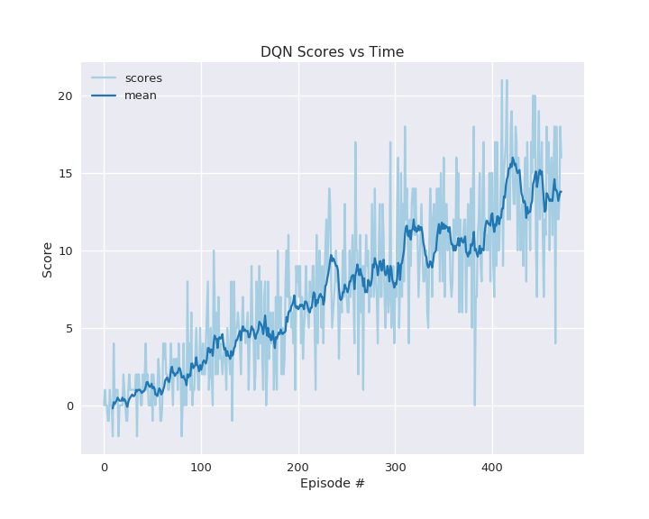
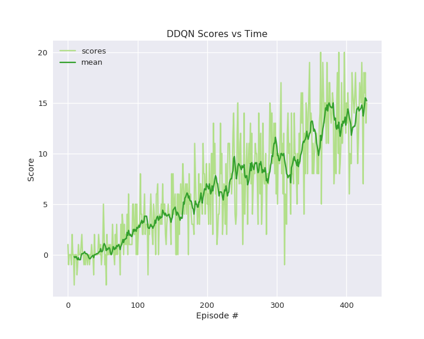

# Navigation

---

You are welcome to use this coding environment to train your agent for the project.  Follow the instructions below to get started!

### 1. Start the Environment

Run the next code cell to install a few packages.  This line will take a few minutes to run!
diode = False # Set to true if in data diode
cloud = True  # set to true if in Cloudif diode:
    import sys
    sys.path.append('../ml-agents-0.4.0/python')

if cloud and not diode:
    !pip -q install ./python
~~The environment is already saved in the Workspace and can be accessed at the file path provided below.  Please run the next code cell without making any changes.~~

Next, we will start the environment!  **_Before running the code cell below_**, change the `file_name` parameter to match the location of the Unity environment that you downloaded.

- **Mac**: `"path/to/Banana.app"`
- **Windows** (x86): `"path/to/Banana_Windows_x86/Banana.exe"`
- **Windows** (x86_64): `"path/to/Banana_Windows_x86_64/Banana.exe"`
- **Linux** (x86): `"path/to/Banana_Linux/Banana.x86"`
- **Linux** (x86_64): `"path/to/Banana_Linux/Banana.x86_64"`
- **Linux** (x86, headless): `"path/to/Banana_Linux_NoVis/Banana.x86"`
- **Linux** (x86_64, headless): `"path/to/Banana_Linux_NoVis/Banana.x86_64"`

For instance, if you are using a Mac, then you downloaded `Banana.app`.  If this file is in the same folder as the notebook, then the line below should appear as follows:
```
env = UnityEnvironment(file_name="Banana.app")
```
from unityagents import UnityEnvironment
import numpy as np

# please do not modify the line below
if diode:
    file="/../Banana_Linux_NoVis/Banana.x86_64"
elif cloud:
    file="/data/Banana_Linux_NoVis/Banana.x86_64"
else:
    file='data/Banana_Windows_x86_64/Banana.exe'
    
env = UnityEnvironment(file_name=file)
Environments contain **_brains_** which are responsible for deciding the actions of their associated agents. Here we check for the first brain available, and set it as the default brain we will be controlling from Python.
# get the default brain
brain_name = env.brain_names[0]
brain = env.brains[brain_name]
### 2. Examine the State and Action Spaces

Run the code cell below to print some information about the environment.
# reset the environment
env_info = env.reset(train_mode=True)[brain_name]

# number of agents in the environment
print('Number of agents:', len(env_info.agents))

# number of actions
action_size = brain.vector_action_space_size
print('Number of actions:', action_size)

# examine the state space 
state = env_info.vector_observations[0]
print('States look like:', state)
state_size = len(state)
print('States have length:', state_size)
### 3. Take Random Actions in the Environment

In the next code cell, you will learn how to use the Python API to control the agent and receive feedback from the environment.

Note that **in this coding environment, you will not be able to watch the agent while it is training**, and you should set `train_mode=True` to restart the environment.
env_info = env.reset(train_mode=True)[brain_name] # reset the environment
state = env_info.vector_observations[0]            # get the current state
score = 0                                          # initialize the score
while True:
    action = np.random.randint(action_size)        # select an action
    env_info = env.step(action)[brain_name]        # send the action to the environment
    next_state = env_info.vector_observations[0]   # get the next state
    reward = env_info.rewards[0]                   # get the reward
    done = env_info.local_done[0]                  # see if episode has finished
    score += reward                                # update the score
    state = next_state                             # roll over the state to next time step
    if done:                                       # exit loop if episode finished
        break
    
print("Score: {}".format(score))
When finished, you can close the environment.
env.close()
### 4. It's Your Turn!

Now it's your turn to train your own agent to solve the environment!  A few **important notes**:
- When training the environment, set `train_mode=True`, so that the line for resetting the environment looks like the following:
```python
env_info = env.reset(train_mode=True)[brain_name]
```
- To structure your work, you're welcome to work directly in this Jupyter notebook, or you might like to start over with a new file!  You can see the list of files in the workspace by clicking on **_Jupyter_** in the top left corner of the notebook.
- In this coding environment, you will not be able to watch the agent while it is training.  However, **_after training the agent_**, you can download the saved model weights to watch the agent on your own machine! 

## 4.1 DQN

### Model Architecture + Init

#### Backgound

The following section instantiates an agent using the Deep Q-Learning Algorithm
as proposed by [Mnih 2015](https://storage.googleapis.com/deepmind-media/dqn/DQNNaturePaper.pdf)
leveraging several pieces of code from Udacity's Deep Reinforement Learning Course.

#### Project Overview

The project architecture along with the DQN agent and following agents been abstracted to be used
with open AI gym models along with Udacity's ML-Agent models in order to provide a quick 
prototyping testbed for debugging.

#### DQN Description

The Neural Network used within the `DQNAgent` (and `DDQNAgent` below) utilizes three fully connected layers instantiated within the `QNetwork` classes. The input demensions are defined by the state size (37 for the Banana Environment), two hidden layers (defaulted to equal sizes of 64 nodes), and the output dimension equal to the action size (4 for the Banana Environment). The first and second layers are passed through a leaky RELU activation function and the final layer is direclty returned, since the response will be compared to the target network as described by Deep Q-Learning.

The DQN algorithm is largly contained within the `learn` method where Q-values are gathered from the target network, $Q^{hat}_{max}(s', \theta^-)$, given the next state, $s'$, the maximum action, $argmax(a')$, and target weights, $\theta^-$. These Q-values are then evaluated given the reward, $r$, discount rate, $\gamma$ such that $y = r + \gamma * Q^{hat}_{max}(s', a', \theta^-)$. The result is finally evaluated against the expected Q-Values, $Q(s, a, \theta)$, for the current state, $s$, action, $a$, and local weights, $theta$. The mean-squared error is evaluated from the difference of the values and backpropogation is conducted using an Adam optimizer. Soft updating is conducted with an interpolation parameter of, $\tau = 1.0e-3$.


#### Hyperparameters

```python
hyperparameters = DQNAgent(
    state_size: int = 37,
    action_size: int = 4,
    device: str = device,  #see below - dependant on resources/environment
    seed_state: int = 42,
    lr: float = 5e-4,
    update_every: int = 4,
    tau: float = 1e-3,
    gamma: float = 0.99,
    batch_size: int = 64,
    buffer_size=int(1e5),
)
```

#### Training

Below, the DQN agent is instantiated and trained below and model performance is then visualized.


```python
diode = False # Set to true if in data diode
cloud = True  # set to true if in Cloud
gym_test = False
```


```python
if not gym_test:
    if diode:
        import sys
        sys.path.insert('../ml-agents-0.4.0/python')
        from unityagents import UnityEnvironment
        from myagent.unity_environments import UnityEnvironmentMgr

    if cloud and not diode:
    #     !pip -q install ./python
        !pip install ./python
else:
    import gym
```

    Processing ./python
    Collecting tensorflow==1.7.1 (from unityagents==0.4.0)
    [?25l  Downloading https://files.pythonhosted.org/packages/66/83/35c3f53129dfc80d65ebbe07ef0575263c3c05cc37f8c713674dcedcea6f/tensorflow-1.7.1-cp36-cp36m-manylinux1_x86_64.whl (48.1MB)
        100% |████████████████████████████████| 48.1MB 760kB/s eta 0:00:01  6% |██▏                             | 3.2MB 30.6MB/s eta 0:00:02    12% |████                            | 6.1MB 28.7MB/s eta 0:00:02    15% |█████                           | 7.4MB 28.1MB/s eta 0:00:02    18% |█████▉                          | 8.8MB 28.7MB/s eta 0:00:02    27% |████████▋                       | 13.0MB 27.3MB/s eta 0:00:02    32% |██████████▌                     | 15.8MB 28.1MB/s eta 0:00:02    54% |█████████████████▋              | 26.4MB 27.7MB/s eta 0:00:01    68% |█████████████████████▉          | 32.8MB 26.6MB/s eta 0:00:01    75% |████████████████████████▎       | 36.4MB 24.2MB/s eta 0:00:01    85% |███████████████████████████▎    | 41.0MB 25.6MB/s eta 0:00:01    91% |█████████████████████████████▍  | 44.2MB 20.8MB/s eta 0:00:01    96% |███████████████████████████████ | 46.5MB 23.0MB/s eta 0:00:01
    [?25hRequirement already satisfied: Pillow>=4.2.1 in /opt/conda/lib/python3.6/site-packages (from unityagents==0.4.0) (5.2.0)
    Requirement already satisfied: matplotlib in /opt/conda/lib/python3.6/site-packages (from unityagents==0.4.0) (2.1.0)
    Requirement already satisfied: numpy>=1.11.0 in /opt/conda/lib/python3.6/site-packages (from unityagents==0.4.0) (1.12.1)
    Collecting jupyter (from unityagents==0.4.0)
      Downloading https://files.pythonhosted.org/packages/83/df/0f5dd132200728a86190397e1ea87cd76244e42d39ec5e88efd25b2abd7e/jupyter-1.0.0-py2.py3-none-any.whl
    Requirement already satisfied: pytest>=3.2.2 in /opt/conda/lib/python3.6/site-packages (from unityagents==0.4.0) (4.5.0)
    Collecting docopt (from unityagents==0.4.0)
      Downloading https://files.pythonhosted.org/packages/a2/55/8f8cab2afd404cf578136ef2cc5dfb50baa1761b68c9da1fb1e4eed343c9/docopt-0.6.2.tar.gz
    Requirement already satisfied: pyyaml in /opt/conda/lib/python3.6/site-packages (from unityagents==0.4.0) (3.12)
    Collecting protobuf==3.5.2 (from unityagents==0.4.0)
    [?25l  Downloading https://files.pythonhosted.org/packages/9b/0d/6e9cf54be86c742a375a0ca0addadb582c890939b1b6d3339570e51091bd/protobuf-3.5.2-cp36-cp36m-manylinux1_x86_64.whl (6.4MB)
        100% |████████████████████████████████| 6.4MB 4.0MB/s eta 0:00:01   1% |▋                               | 112kB 18.3MB/s eta 0:00:01    34% |███████████▏                    | 2.2MB 22.0MB/s eta 0:00:01    69% |██████████████████████▎         | 4.5MB 23.1MB/s eta 0:00:01    84% |███████████████████████████     | 5.4MB 21.3MB/s eta 0:00:01
    [?25hCollecting grpcio==1.11.0 (from unityagents==0.4.0)
    [?25l  Downloading https://files.pythonhosted.org/packages/c8/b8/00e703183b7ae5e02f161dafacdfa8edbd7234cb7434aef00f126a3a511e/grpcio-1.11.0-cp36-cp36m-manylinux1_x86_64.whl (8.8MB)
        100% |████████████████████████████████| 8.8MB 5.2MB/s eta 0:00:01    11% |███▋                            | 1.0MB 19.7MB/s eta 0:00:01    23% |███████▍                        | 2.0MB 22.7MB/s eta 0:00:01    34% |███████████                     | 3.0MB 21.9MB/s eta 0:00:01    58% |██████████████████▉             | 5.2MB 21.9MB/s eta 0:00:01    69% |██████████████████████▍         | 6.1MB 21.6MB/s eta 0:00:01    82% |██████████████████████████▍     | 7.2MB 22.2MB/s eta 0:00:01    93% |██████████████████████████████  | 8.3MB 22.6MB/s eta 0:00:01
    [?25hRequirement already satisfied: torch==0.4.0 in /opt/conda/lib/python3.6/site-packages (from unityagents==0.4.0) (0.4.0)
    Requirement already satisfied: pandas in /opt/conda/lib/python3.6/site-packages (from unityagents==0.4.0) (0.23.3)
    Requirement already satisfied: scipy in /opt/conda/lib/python3.6/site-packages (from unityagents==0.4.0) (1.2.1)
    Requirement already satisfied: ipykernel in /opt/conda/lib/python3.6/site-packages (from unityagents==0.4.0) (4.9.0)
    Requirement already satisfied: six>=1.10.0 in /opt/conda/lib/python3.6/site-packages (from tensorflow==1.7.1->unityagents==0.4.0) (1.11.0)
    Collecting gast>=0.2.0 (from tensorflow==1.7.1->unityagents==0.4.0)
      Downloading https://files.pythonhosted.org/packages/ad/b0/a6c8bc1e77409b63755bb0788ac4d497d31b72082de5945c0122259c533e/gast-0.5.2-py3-none-any.whl
    Collecting absl-py>=0.1.6 (from tensorflow==1.7.1->unityagents==0.4.0)
    [?25l  Downloading https://files.pythonhosted.org/packages/23/47/835652c7e19530973c73c65e652fc53bd05725d5a7cf9bb8706777869c1e/absl_py-0.13.0-py3-none-any.whl (132kB)
        100% |████████████████████████████████| 133kB 12.4MB/s ta 0:00:01
    [?25hCollecting tensorboard<1.8.0,>=1.7.0 (from tensorflow==1.7.1->unityagents==0.4.0)
    [?25l  Downloading https://files.pythonhosted.org/packages/0b/ec/65d4e8410038ca2a78c09034094403d231228d0ddcae7d470b223456e55d/tensorboard-1.7.0-py3-none-any.whl (3.1MB)
        100% |████████████████████████████████| 3.1MB 11.0MB/s ta 0:00:01    44% |██████████████▏                 | 1.4MB 20.6MB/s eta 0:00:01    79% |█████████████████████████▍      | 2.5MB 19.8MB/s eta 0:00:01
    [?25hCollecting termcolor>=1.1.0 (from tensorflow==1.7.1->unityagents==0.4.0)
      Downloading https://files.pythonhosted.org/packages/8a/48/a76be51647d0eb9f10e2a4511bf3ffb8cc1e6b14e9e4fab46173aa79f981/termcolor-1.1.0.tar.gz
    Collecting astor>=0.6.0 (from tensorflow==1.7.1->unityagents==0.4.0)
      Downloading https://files.pythonhosted.org/packages/c3/88/97eef84f48fa04fbd6750e62dcceafba6c63c81b7ac1420856c8dcc0a3f9/astor-0.8.1-py2.py3-none-any.whl
    Requirement already satisfied: wheel>=0.26 in /opt/conda/lib/python3.6/site-packages (from tensorflow==1.7.1->unityagents==0.4.0) (0.30.0)
    Requirement already satisfied: python-dateutil>=2.0 in /opt/conda/lib/python3.6/site-packages (from matplotlib->unityagents==0.4.0) (2.6.1)
    Requirement already satisfied: pytz in /opt/conda/lib/python3.6/site-packages (from matplotlib->unityagents==0.4.0) (2017.3)
    Requirement already satisfied: cycler>=0.10 in /opt/conda/lib/python3.6/site-packages/cycler-0.10.0-py3.6.egg (from matplotlib->unityagents==0.4.0) (0.10.0)
    Requirement already satisfied: pyparsing!=2.0.4,!=2.1.2,!=2.1.6,>=2.0.1 in /opt/conda/lib/python3.6/site-packages (from matplotlib->unityagents==0.4.0) (2.2.0)
    Collecting qtconsole (from jupyter->unityagents==0.4.0)
    [?25l  Downloading https://files.pythonhosted.org/packages/3a/57/c8fc1fc6fb6bc03caca20ace9cd0ac0e16cc052b51cbe3acbeeb53abcb18/qtconsole-5.1.1-py3-none-any.whl (119kB)
        100% |████████████████████████████████| 122kB 11.4MB/s ta 0:00:01
    [?25hRequirement already satisfied: notebook in /opt/conda/lib/python3.6/site-packages (from jupyter->unityagents==0.4.0) (5.7.0)
    Collecting jupyter-console (from jupyter->unityagents==0.4.0)
      Downloading https://files.pythonhosted.org/packages/59/cd/aa2670ffc99eb3e5bbe2294c71e4bf46a9804af4f378d09d7a8950996c9b/jupyter_console-6.4.0-py3-none-any.whl
    Requirement already satisfied: nbconvert in /opt/conda/lib/python3.6/site-packages (from jupyter->unityagents==0.4.0) (5.4.0)
    Requirement already satisfied: ipywidgets in /opt/conda/lib/python3.6/site-packages (from jupyter->unityagents==0.4.0) (7.0.5)
    Requirement already satisfied: pluggy!=0.10,<1.0,>=0.9 in /opt/conda/lib/python3.6/site-packages (from pytest>=3.2.2->unityagents==0.4.0) (0.11.0)
    Requirement already satisfied: py>=1.5.0 in /opt/conda/lib/python3.6/site-packages (from pytest>=3.2.2->unityagents==0.4.0) (1.8.0)
    Requirement already satisfied: wcwidth in /opt/conda/lib/python3.6/site-packages (from pytest>=3.2.2->unityagents==0.4.0) (0.1.7)
    Requirement already satisfied: setuptools in /opt/conda/lib/python3.6/site-packages (from pytest>=3.2.2->unityagents==0.4.0) (38.4.0)
    Requirement already satisfied: more-itertools>=4.0.0; python_version > "2.7" in /opt/conda/lib/python3.6/site-packages (from pytest>=3.2.2->unityagents==0.4.0) (7.0.0)
    Requirement already satisfied: attrs>=17.4.0 in /opt/conda/lib/python3.6/site-packages (from pytest>=3.2.2->unityagents==0.4.0) (19.1.0)
    Requirement already satisfied: atomicwrites>=1.0 in /opt/conda/lib/python3.6/site-packages (from pytest>=3.2.2->unityagents==0.4.0) (1.3.0)
    Requirement already satisfied: ipython>=4.0.0 in /opt/conda/lib/python3.6/site-packages (from ipykernel->unityagents==0.4.0) (6.5.0)
    Requirement already satisfied: traitlets>=4.1.0 in /opt/conda/lib/python3.6/site-packages (from ipykernel->unityagents==0.4.0) (4.3.2)
    Requirement already satisfied: jupyter_client in /opt/conda/lib/python3.6/site-packages (from ipykernel->unityagents==0.4.0) (5.2.4)
    Requirement already satisfied: tornado>=4.0 in /opt/conda/lib/python3.6/site-packages (from ipykernel->unityagents==0.4.0) (4.5.3)
    Requirement already satisfied: markdown>=2.6.8 in /opt/conda/lib/python3.6/site-packages (from tensorboard<1.8.0,>=1.7.0->tensorflow==1.7.1->unityagents==0.4.0) (2.6.9)
    Requirement already satisfied: bleach==1.5.0 in /opt/conda/lib/python3.6/site-packages (from tensorboard<1.8.0,>=1.7.0->tensorflow==1.7.1->unityagents==0.4.0) (1.5.0)
    Requirement already satisfied: html5lib==0.9999999 in /opt/conda/lib/python3.6/site-packages (from tensorboard<1.8.0,>=1.7.0->tensorflow==1.7.1->unityagents==0.4.0) (0.9999999)
    Requirement already satisfied: werkzeug>=0.11.10 in /opt/conda/lib/python3.6/site-packages (from tensorboard<1.8.0,>=1.7.0->tensorflow==1.7.1->unityagents==0.4.0) (0.14.1)
    Requirement already satisfied: jupyter-core in /opt/conda/lib/python3.6/site-packages (from qtconsole->jupyter->unityagents==0.4.0) (4.4.0)
    Requirement already satisfied: pygments in /opt/conda/lib/python3.6/site-packages (from qtconsole->jupyter->unityagents==0.4.0) (2.2.0)
    Collecting qtpy (from qtconsole->jupyter->unityagents==0.4.0)
    [?25l  Downloading https://files.pythonhosted.org/packages/cd/fd/9972948f02e967b691cc0ca1f26124826a3b88cb38f412a8b7935b8c3c72/QtPy-1.9.0-py2.py3-none-any.whl (54kB)
        100% |████████████████████████████████| 61kB 10.4MB/s ta 0:00:01
    [?25hRequirement already satisfied: pyzmq>=17.1 in /opt/conda/lib/python3.6/site-packages (from qtconsole->jupyter->unityagents==0.4.0) (17.1.2)
    Requirement already satisfied: ipython-genutils in /opt/conda/lib/python3.6/site-packages (from qtconsole->jupyter->unityagents==0.4.0) (0.2.0)
    Requirement already satisfied: jinja2 in /opt/conda/lib/python3.6/site-packages (from notebook->jupyter->unityagents==0.4.0) (2.10)
    Requirement already satisfied: nbformat in /opt/conda/lib/python3.6/site-packages (from notebook->jupyter->unityagents==0.4.0) (4.4.0)
    Requirement already satisfied: Send2Trash in /opt/conda/lib/python3.6/site-packages (from notebook->jupyter->unityagents==0.4.0) (1.5.0)
    Requirement already satisfied: terminado>=0.8.1 in /opt/conda/lib/python3.6/site-packages (from notebook->jupyter->unityagents==0.4.0) (0.8.1)
    Requirement already satisfied: prometheus_client in /opt/conda/lib/python3.6/site-packages (from notebook->jupyter->unityagents==0.4.0) (0.3.1)
    Collecting prompt-toolkit!=3.0.0,!=3.0.1,<3.1.0,>=2.0.0 (from jupyter-console->jupyter->unityagents==0.4.0)
    [?25l  Downloading https://files.pythonhosted.org/packages/1e/34/1d9880ac1339ad4c6697b330e7a507584105613751318249d9e820faa25f/prompt_toolkit-3.0.19-py3-none-any.whl (368kB)
        100% |████████████████████████████████| 368kB 12.5MB/s ta 0:00:01
    [?25hRequirement already satisfied: mistune>=0.8.1 in /opt/conda/lib/python3.6/site-packages (from nbconvert->jupyter->unityagents==0.4.0) (0.8.3)
    Requirement already satisfied: entrypoints>=0.2.2 in /opt/conda/lib/python3.6/site-packages (from nbconvert->jupyter->unityagents==0.4.0) (0.2.3)
    Requirement already satisfied: pandocfilters>=1.4.1 in /opt/conda/lib/python3.6/site-packages (from nbconvert->jupyter->unityagents==0.4.0) (1.4.1)
    Requirement already satisfied: testpath in /opt/conda/lib/python3.6/site-packages (from nbconvert->jupyter->unityagents==0.4.0) (0.3.1)
    Requirement already satisfied: defusedxml in /opt/conda/lib/python3.6/site-packages (from nbconvert->jupyter->unityagents==0.4.0) (0.5.0)
    Collecting widgetsnbextension~=3.0.0 (from ipywidgets->jupyter->unityagents==0.4.0)
    [?25l  Downloading https://files.pythonhosted.org/packages/8d/f2/c8bcccccbed39d51d3e237fb0c0f0c9bbc845d12afc41f5ca5f5728fffc7/widgetsnbextension-3.0.8-py2.py3-none-any.whl (2.2MB)
        100% |████████████████████████████████| 2.2MB 10.6MB/s ta 0:00:01   7% |██▌                             | 174kB 21.6MB/s eta 0:00:01    56% |██████████████████              | 1.2MB 20.7MB/s eta 0:00:01
    [?25hRequirement already satisfied: pexpect; sys_platform != "win32" in /opt/conda/lib/python3.6/site-packages (from ipython>=4.0.0->ipykernel->unityagents==0.4.0) (4.3.1)
    Requirement already satisfied: backcall in /opt/conda/lib/python3.6/site-packages (from ipython>=4.0.0->ipykernel->unityagents==0.4.0) (0.1.0)
    Requirement already satisfied: jedi>=0.10 in /opt/conda/lib/python3.6/site-packages (from ipython>=4.0.0->ipykernel->unityagents==0.4.0) (0.10.2)
    Requirement already satisfied: decorator in /opt/conda/lib/python3.6/site-packages (from ipython>=4.0.0->ipykernel->unityagents==0.4.0) (4.0.11)
    Requirement already satisfied: pickleshare in /opt/conda/lib/python3.6/site-packages (from ipython>=4.0.0->ipykernel->unityagents==0.4.0) (0.7.4)
    Requirement already satisfied: simplegeneric>0.8 in /opt/conda/lib/python3.6/site-packages (from ipython>=4.0.0->ipykernel->unityagents==0.4.0) (0.8.1)
    Requirement already satisfied: MarkupSafe>=0.23 in /opt/conda/lib/python3.6/site-packages (from jinja2->notebook->jupyter->unityagents==0.4.0) (1.0)
    Requirement already satisfied: jsonschema!=2.5.0,>=2.4 in /opt/conda/lib/python3.6/site-packages (from nbformat->notebook->jupyter->unityagents==0.4.0) (2.6.0)
    Requirement already satisfied: ptyprocess>=0.5 in /opt/conda/lib/python3.6/site-packages (from pexpect; sys_platform != "win32"->ipython>=4.0.0->ipykernel->unityagents==0.4.0) (0.5.2)
    Building wheels for collected packages: unityagents, docopt, termcolor
      Running setup.py bdist_wheel for unityagents ... [?25ldone
    [?25h  Stored in directory: /tmp/pip-ephem-wheel-cache-060xrz7z/wheels/97/7a/24/09937717b9737178ae827bcef33ba219b540efd55be210010c
      Running setup.py bdist_wheel for docopt ... [?25ldone
    [?25h  Stored in directory: /root/.cache/pip/wheels/9b/04/dd/7daf4150b6d9b12949298737de9431a324d4b797ffd63f526e
      Running setup.py bdist_wheel for termcolor ... [?25ldone
    [?25h  Stored in directory: /root/.cache/pip/wheels/7c/06/54/bc84598ba1daf8f970247f550b175aaaee85f68b4b0c5ab2c6
    Successfully built unityagents docopt termcolor
    tensorflow 1.7.1 has requirement numpy>=1.13.3, but you'll have numpy 1.12.1 which is incompatible.
    ipython 6.5.0 has requirement prompt-toolkit<2.0.0,>=1.0.15, but you'll have prompt-toolkit 3.0.19 which is incompatible.
    Installing collected packages: protobuf, grpcio, gast, absl-py, tensorboard, termcolor, astor, tensorflow, qtpy, qtconsole, prompt-toolkit, jupyter-console, jupyter, docopt, unityagents, widgetsnbextension
      Found existing installation: protobuf 3.5.1
        Uninstalling protobuf-3.5.1:
          Successfully uninstalled protobuf-3.5.1
      Found existing installation: tensorflow 1.3.0
        Uninstalling tensorflow-1.3.0:
          Successfully uninstalled tensorflow-1.3.0
      Found existing installation: prompt-toolkit 1.0.15
        Uninstalling prompt-toolkit-1.0.15:
          Successfully uninstalled prompt-toolkit-1.0.15
      Found existing installation: widgetsnbextension 3.1.0
        Uninstalling widgetsnbextension-3.1.0:
          Successfully uninstalled widgetsnbextension-3.1.0
    Successfully installed absl-py-0.13.0 astor-0.8.1 docopt-0.6.2 gast-0.5.2 grpcio-1.11.0 jupyter-1.0.0 jupyter-console-6.4.0 prompt-toolkit-3.0.19 protobuf-3.5.2 qtconsole-5.1.1 qtpy-1.9.0 tensorboard-1.7.0 tensorflow-1.7.1 termcolor-1.1.0 unityagents-0.4.0 widgetsnbextension-3.0.8


```python
import numpy as np
import random

import torch
import torch.nn as nn
import torch.nn.functional as F

import matplotlib.pyplot as plt

# LOCAL IMPORT
from myagent.agents import Agent, DQNAgent, ReplayBuffer
from myagent.environments import EnvironmentMgr, GymEnvironmentMgr
from myagent.trainers import Trainer, DQNTrainer
from myagent.qnetworks import QNetwork


%matplotlib inline
```


```python
# CITATION: From Udacity's Deep Learning course, CycleGAN exercise
# ACM: I don't think I need convolutional layers since I am only 
#      ingesting state data - not pixels
def my_conv(in_channels, out_channels, kernel_size, stride=2, padding=1, batch_norm=True):
    """Creates a convolutional layer, with optional batch normalization.
    """
    layers = []
    conv_layer = nn.Conv2d(in_channels=in_channels, out_channels=out_channels, 
                           kernel_size=kernel_size, stride=stride, padding=padding, bias=False)
    
    layers.append(conv_layer)

    if batch_norm:
        layers.append(nn.BatchNorm2d(out_channels))
    return nn.Sequential(*layers)
    
# helper deconv function
def my_deconv(in_channels, out_channels, kernel_size, stride=2, padding=1, batch_norm=True):
    """Creates a transpose convolutional layer, with optional batch normalization.
    """
    layers = []
    # append transpose conv layer
    layers.append(nn.ConvTranspose2d(in_channels, out_channels, kernel_size, stride, padding, bias=False))
    # optional batch norm layer
    if batch_norm:
        layers.append(nn.BatchNorm2d(out_channels))
    return nn.Sequential(*layers)
```

### Instantiate


```python
ran_once = False
if gym_test:
    envh = GymEnvironmentMgr('LunarLander-v2')
elif not ran_once:
    if diode:
        file = "/../Banana_Linux_NoVis/Banana.x86_64"
    elif cloud:
        file = "/data/Banana_Linux_NoVis/Banana.x86_64"
    else:
        file = 'data/Banana_Windows_x86_64/Banana.exe'
    from myagent.unity_environments import UnityEnvironmentMgr
    envh = UnityEnvironmentMgr(file)
    ran_once = True
    
```


```python
envh.start()
state_size = envh.state_size
action_size = envh.action_size
```

    INFO:unityagents:
    'Academy' started successfully!
    Unity Academy name: Academy
            Number of Brains: 1
            Number of External Brains : 1
            Lesson number : 0
            Reset Parameters :
    		
    Unity brain name: BananaBrain
            Number of Visual Observations (per agent): 0
            Vector Observation space type: continuous
            Vector Observation space size (per agent): 37
            Number of stacked Vector Observation: 1
            Vector Action space type: discrete
            Vector Action space size (per agent): 4
            Vector Action descriptions: , , , 


```python
device = torch.device("cuda:0" if torch.cuda.is_available() else "cpu")
agent = DQNAgent(state_size=state_size, action_size=action_size, seed_state=42, device=device)
trainer = DQNTrainer(agent, envh, solved=13.0, max_t=20000)
# trainer = DQNTrainer(agent, env)
```

### Run


```python
scores = trainer.train()
```

    Episode 100	Average Score: 1.29
    Episode 200	Average Score: 4.62
    Episode 300	Average Score: 7.93
    Episode 400	Average Score: 10.69
    Episode 472	Average Score: 13.03
    Environment solved in 472 episodes!	Average Score: 13.03


The DQN Agent solved the environment in 472 episodes with an average
score of 13.03


```python
# envh.env.close()
```


```python
import datetime
agent = trainer.agent
now = datetime.datetime.now()
save_f = f'checkpoint-banana-dqn-{now.strftime("%Y%m%dT%H%M%S")}.pth'
agent.save(save_f)
```

### Visualize


```python
import pandas as pd
import seaborn as sns
try:
    # Rotate Chorma
    i_map += 1
except NameError:
    sns.set_style('darkgrid')
    sns.set_context('talk')
    sns.set_palette('Paired')
    cmap = sns.color_palette('Paired')
    i_map = 0

fig ,ax = plt.subplots(1,1, figsize=(10,8))
score_df = pd.DataFrame({'scores': scores})
score_df = score_df.assign(mean=lambda df: df.rolling(10).mean()['scores'])
ax = score_df.plot(ax=ax, color=cmap[2*(i_map%3):])
ax.set_title('DQN Scores vs Time')
ax.set_xlabel('Episode #')
ax.set_ylabel('Score')
plt.show()
```





The DQN agent solve the environment well within the required 1800 episodes


```python
save_f = f'agent-banana-dqn-{now.strftime("%Y%m%dT%H%M%S")}.png'
fig.savefig(save_f)
```

## 4.2 DDQN

The following section instantiates an agent using the Double Deep Q-Learning Algorithm
as proposed by [Z Wang 2016](https://arxiv.org/pdf/1511.06581.pdf). The agent shares
similar structure the the DQN agent above except for the `learn` method.

In DDQN, when evaluating Q-tables, the max(action), $a_{max}'$ for the next state, $s'$,
is evaluated from the local Q-network, $Q(\theta)$. Then, $a_{max}'$ is used with $s'$ to evalutate
the expected Q-values from the target Q-network, $Q(\theta')$.

*Z Wang, et al. Dueling Network Architectures for Deep Reinforcement Learning. arXiv, 5 Apr 2016, 1511.06581v3 ( https://arxiv.org/pdf/1511.06581.pdf ).*


```python
diode = False # Set to true if in data diode
cloud = True  # set to true if in Cloud
gym_test = False
```


```python
if not gym_test:
    if diode:
        import sys
        sys.path.insert('../ml-agents-0.4.0/python')
        from unityagents import UnityEnvironment
        from myagent.unity_environments import UnityEnvironmentMgr

    if cloud and not diode:
    #     !pip -q install ./python
        !pip install ./python
else:
    import gym
```

    Processing ./python
    Requirement already satisfied: tensorflow==1.7.1 in /opt/conda/lib/python3.6/site-packages (from unityagents==0.4.0) (1.7.1)
    Requirement already satisfied: Pillow>=4.2.1 in /opt/conda/lib/python3.6/site-packages (from unityagents==0.4.0) (5.2.0)
    Requirement already satisfied: matplotlib in /opt/conda/lib/python3.6/site-packages (from unityagents==0.4.0) (2.1.0)
    Requirement already satisfied: numpy>=1.11.0 in /opt/conda/lib/python3.6/site-packages (from unityagents==0.4.0) (1.12.1)
    Requirement already satisfied: jupyter in /opt/conda/lib/python3.6/site-packages (from unityagents==0.4.0) (1.0.0)
    Requirement already satisfied: pytest>=3.2.2 in /opt/conda/lib/python3.6/site-packages (from unityagents==0.4.0) (4.5.0)
    Requirement already satisfied: docopt in /opt/conda/lib/python3.6/site-packages (from unityagents==0.4.0) (0.6.2)
    Requirement already satisfied: pyyaml in /opt/conda/lib/python3.6/site-packages (from unityagents==0.4.0) (3.12)
    Requirement already satisfied: protobuf==3.5.2 in /opt/conda/lib/python3.6/site-packages (from unityagents==0.4.0) (3.5.2)
    Requirement already satisfied: grpcio==1.11.0 in /opt/conda/lib/python3.6/site-packages (from unityagents==0.4.0) (1.11.0)
    Requirement already satisfied: torch==0.4.0 in /opt/conda/lib/python3.6/site-packages (from unityagents==0.4.0) (0.4.0)
    Requirement already satisfied: pandas in /opt/conda/lib/python3.6/site-packages (from unityagents==0.4.0) (0.23.3)
    Requirement already satisfied: scipy in /opt/conda/lib/python3.6/site-packages (from unityagents==0.4.0) (1.2.1)
    Requirement already satisfied: ipykernel in /opt/conda/lib/python3.6/site-packages (from unityagents==0.4.0) (4.9.0)
    Requirement already satisfied: termcolor>=1.1.0 in /opt/conda/lib/python3.6/site-packages (from tensorflow==1.7.1->unityagents==0.4.0) (1.1.0)
    Requirement already satisfied: astor>=0.6.0 in /opt/conda/lib/python3.6/site-packages (from tensorflow==1.7.1->unityagents==0.4.0) (0.8.1)
    Requirement already satisfied: gast>=0.2.0 in /opt/conda/lib/python3.6/site-packages (from tensorflow==1.7.1->unityagents==0.4.0) (0.5.2)
    Requirement already satisfied: tensorboard<1.8.0,>=1.7.0 in /opt/conda/lib/python3.6/site-packages (from tensorflow==1.7.1->unityagents==0.4.0) (1.7.0)
    Requirement already satisfied: six>=1.10.0 in /opt/conda/lib/python3.6/site-packages (from tensorflow==1.7.1->unityagents==0.4.0) (1.11.0)
    Requirement already satisfied: absl-py>=0.1.6 in /opt/conda/lib/python3.6/site-packages (from tensorflow==1.7.1->unityagents==0.4.0) (0.13.0)
    Requirement already satisfied: wheel>=0.26 in /opt/conda/lib/python3.6/site-packages (from tensorflow==1.7.1->unityagents==0.4.0) (0.30.0)
    Requirement already satisfied: python-dateutil>=2.0 in /opt/conda/lib/python3.6/site-packages (from matplotlib->unityagents==0.4.0) (2.6.1)
    Requirement already satisfied: pytz in /opt/conda/lib/python3.6/site-packages (from matplotlib->unityagents==0.4.0) (2017.3)
    Requirement already satisfied: cycler>=0.10 in /opt/conda/lib/python3.6/site-packages/cycler-0.10.0-py3.6.egg (from matplotlib->unityagents==0.4.0) (0.10.0)
    Requirement already satisfied: pyparsing!=2.0.4,!=2.1.2,!=2.1.6,>=2.0.1 in /opt/conda/lib/python3.6/site-packages (from matplotlib->unityagents==0.4.0) (2.2.0)
    Requirement already satisfied: qtconsole in /opt/conda/lib/python3.6/site-packages (from jupyter->unityagents==0.4.0) (5.1.1)
    Requirement already satisfied: notebook in /opt/conda/lib/python3.6/site-packages (from jupyter->unityagents==0.4.0) (5.7.0)
    Requirement already satisfied: nbconvert in /opt/conda/lib/python3.6/site-packages (from jupyter->unityagents==0.4.0) (5.4.0)
    Requirement already satisfied: ipywidgets in /opt/conda/lib/python3.6/site-packages (from jupyter->unityagents==0.4.0) (7.0.5)
    Requirement already satisfied: jupyter-console in /opt/conda/lib/python3.6/site-packages (from jupyter->unityagents==0.4.0) (6.4.0)
    Requirement already satisfied: attrs>=17.4.0 in /opt/conda/lib/python3.6/site-packages (from pytest>=3.2.2->unityagents==0.4.0) (19.1.0)
    Requirement already satisfied: more-itertools>=4.0.0; python_version > "2.7" in /opt/conda/lib/python3.6/site-packages (from pytest>=3.2.2->unityagents==0.4.0) (7.0.0)
    Requirement already satisfied: setuptools in /opt/conda/lib/python3.6/site-packages (from pytest>=3.2.2->unityagents==0.4.0) (38.4.0)
    Requirement already satisfied: py>=1.5.0 in /opt/conda/lib/python3.6/site-packages (from pytest>=3.2.2->unityagents==0.4.0) (1.8.0)
    Requirement already satisfied: pluggy!=0.10,<1.0,>=0.9 in /opt/conda/lib/python3.6/site-packages (from pytest>=3.2.2->unityagents==0.4.0) (0.11.0)
    Requirement already satisfied: wcwidth in /opt/conda/lib/python3.6/site-packages (from pytest>=3.2.2->unityagents==0.4.0) (0.1.7)
    Requirement already satisfied: atomicwrites>=1.0 in /opt/conda/lib/python3.6/site-packages (from pytest>=3.2.2->unityagents==0.4.0) (1.3.0)
    Requirement already satisfied: ipython>=4.0.0 in /opt/conda/lib/python3.6/site-packages (from ipykernel->unityagents==0.4.0) (6.5.0)
    Requirement already satisfied: traitlets>=4.1.0 in /opt/conda/lib/python3.6/site-packages (from ipykernel->unityagents==0.4.0) (4.3.2)
    Requirement already satisfied: jupyter_client in /opt/conda/lib/python3.6/site-packages (from ipykernel->unityagents==0.4.0) (5.2.4)
    Requirement already satisfied: tornado>=4.0 in /opt/conda/lib/python3.6/site-packages (from ipykernel->unityagents==0.4.0) (4.5.3)
    Requirement already satisfied: html5lib==0.9999999 in /opt/conda/lib/python3.6/site-packages (from tensorboard<1.8.0,>=1.7.0->tensorflow==1.7.1->unityagents==0.4.0) (0.9999999)
    Requirement already satisfied: bleach==1.5.0 in /opt/conda/lib/python3.6/site-packages (from tensorboard<1.8.0,>=1.7.0->tensorflow==1.7.1->unityagents==0.4.0) (1.5.0)
    Requirement already satisfied: markdown>=2.6.8 in /opt/conda/lib/python3.6/site-packages (from tensorboard<1.8.0,>=1.7.0->tensorflow==1.7.1->unityagents==0.4.0) (2.6.9)
    Requirement already satisfied: werkzeug>=0.11.10 in /opt/conda/lib/python3.6/site-packages (from tensorboard<1.8.0,>=1.7.0->tensorflow==1.7.1->unityagents==0.4.0) (0.14.1)
    Requirement already satisfied: pygments in /opt/conda/lib/python3.6/site-packages (from qtconsole->jupyter->unityagents==0.4.0) (2.2.0)
    Requirement already satisfied: ipython-genutils in /opt/conda/lib/python3.6/site-packages (from qtconsole->jupyter->unityagents==0.4.0) (0.2.0)
    Requirement already satisfied: jupyter-core in /opt/conda/lib/python3.6/site-packages (from qtconsole->jupyter->unityagents==0.4.0) (4.4.0)
    Requirement already satisfied: pyzmq>=17.1 in /opt/conda/lib/python3.6/site-packages (from qtconsole->jupyter->unityagents==0.4.0) (17.1.2)
    Requirement already satisfied: qtpy in /opt/conda/lib/python3.6/site-packages (from qtconsole->jupyter->unityagents==0.4.0) (1.9.0)
    Requirement already satisfied: jinja2 in /opt/conda/lib/python3.6/site-packages (from notebook->jupyter->unityagents==0.4.0) (2.10)
    Requirement already satisfied: nbformat in /opt/conda/lib/python3.6/site-packages (from notebook->jupyter->unityagents==0.4.0) (4.4.0)
    Requirement already satisfied: Send2Trash in /opt/conda/lib/python3.6/site-packages (from notebook->jupyter->unityagents==0.4.0) (1.5.0)
    Requirement already satisfied: terminado>=0.8.1 in /opt/conda/lib/python3.6/site-packages (from notebook->jupyter->unityagents==0.4.0) (0.8.1)
    Requirement already satisfied: prometheus_client in /opt/conda/lib/python3.6/site-packages (from notebook->jupyter->unityagents==0.4.0) (0.3.1)
    Requirement already satisfied: mistune>=0.8.1 in /opt/conda/lib/python3.6/site-packages (from nbconvert->jupyter->unityagents==0.4.0) (0.8.3)
    Requirement already satisfied: entrypoints>=0.2.2 in /opt/conda/lib/python3.6/site-packages (from nbconvert->jupyter->unityagents==0.4.0) (0.2.3)
    Requirement already satisfied: pandocfilters>=1.4.1 in /opt/conda/lib/python3.6/site-packages (from nbconvert->jupyter->unityagents==0.4.0) (1.4.1)
    Requirement already satisfied: testpath in /opt/conda/lib/python3.6/site-packages (from nbconvert->jupyter->unityagents==0.4.0) (0.3.1)
    Requirement already satisfied: defusedxml in /opt/conda/lib/python3.6/site-packages (from nbconvert->jupyter->unityagents==0.4.0) (0.5.0)
    Requirement already satisfied: widgetsnbextension~=3.0.0 in /opt/conda/lib/python3.6/site-packages (from ipywidgets->jupyter->unityagents==0.4.0) (3.0.8)
    Requirement already satisfied: prompt-toolkit!=3.0.0,!=3.0.1,<3.1.0,>=2.0.0 in /opt/conda/lib/python3.6/site-packages (from jupyter-console->jupyter->unityagents==0.4.0) (3.0.19)
    Requirement already satisfied: decorator in /opt/conda/lib/python3.6/site-packages (from ipython>=4.0.0->ipykernel->unityagents==0.4.0) (4.0.11)
    Requirement already satisfied: backcall in /opt/conda/lib/python3.6/site-packages (from ipython>=4.0.0->ipykernel->unityagents==0.4.0) (0.1.0)
    Requirement already satisfied: pickleshare in /opt/conda/lib/python3.6/site-packages (from ipython>=4.0.0->ipykernel->unityagents==0.4.0) (0.7.4)
    Requirement already satisfied: simplegeneric>0.8 in /opt/conda/lib/python3.6/site-packages (from ipython>=4.0.0->ipykernel->unityagents==0.4.0) (0.8.1)
    Requirement already satisfied: pexpect; sys_platform != "win32" in /opt/conda/lib/python3.6/site-packages (from ipython>=4.0.0->ipykernel->unityagents==0.4.0) (4.3.1)
    Requirement already satisfied: jedi>=0.10 in /opt/conda/lib/python3.6/site-packages (from ipython>=4.0.0->ipykernel->unityagents==0.4.0) (0.10.2)
    Requirement already satisfied: MarkupSafe>=0.23 in /opt/conda/lib/python3.6/site-packages (from jinja2->notebook->jupyter->unityagents==0.4.0) (1.0)
    Requirement already satisfied: jsonschema!=2.5.0,>=2.4 in /opt/conda/lib/python3.6/site-packages (from nbformat->notebook->jupyter->unityagents==0.4.0) (2.6.0)
    Requirement already satisfied: ptyprocess>=0.5 in /opt/conda/lib/python3.6/site-packages (from pexpect; sys_platform != "win32"->ipython>=4.0.0->ipykernel->unityagents==0.4.0) (0.5.2)
    Building wheels for collected packages: unityagents
      Running setup.py bdist_wheel for unityagents ... [?25ldone
    [?25h  Stored in directory: /tmp/pip-ephem-wheel-cache-9lzdp3nu/wheels/97/7a/24/09937717b9737178ae827bcef33ba219b540efd55be210010c
    Successfully built unityagents
    Installing collected packages: unityagents
      Found existing installation: unityagents 0.4.0
        Uninstalling unityagents-0.4.0:
          Successfully uninstalled unityagents-0.4.0
    Successfully installed unityagents-0.4.0


```python
import numpy as np
import random

import torch
import torch.nn as nn
import torch.nn.functional as F

import matplotlib.pyplot as plt

# LOCAL IMPORT
from myagent.agents import DDQNAgent
from myagent.trainers import DQNTrainer

%matplotlib inline
```

### Instantiate


```python
# Prevent running from previous sections
try:
    ran_once
except NameError:
    ran_once = False
    
# Load Environment
if gym_test:
    from myagent.environments import GymEnvironmentMgr
    envh = GymEnvironmentMgr('LunarLander-v2')
elif not ran_once:
    if diode:
        file = "/../Banana_Linux_NoVis/Banana.x86_64"
    elif cloud:
        file = "/data/Banana_Linux_NoVis/Banana.x86_64"
    else:
        file = 'data/Banana_Windows_x86_64/Banana.exe'
    from myagent.unity_environments import UnityEnvironmentMgr
    envh = UnityEnvironmentMgr(file)
    ran_once = True
    
```


```python
envh.start()
state_size = envh.state_size
action_size = envh.action_size
device = torch.device("cuda:0" if torch.cuda.is_available() else "cpu")
```


```python
ddqn_agent = DDQNAgent(state_size=state_size, action_size=action_size, seed_state=42, device=device)
ddqn_trainer = DQNTrainer(ddqn_agent, envh, solved=13.0, max_t=20000)
# trainer = DQNTrainer(agent, env)
```

### Run


```python
ddqn_scores = ddqn_trainer.train()
```

    Episode 100	Average Score: 0.73
    Episode 200	Average Score: 4.38
    Episode 300	Average Score: 8.03
    Episode 400	Average Score: 11.52
    Episode 430	Average Score: 13.08
    Environment solved in 430 episodes!	Average Score: 13.08


The DDQN Agent solved the environment in 430 episodes with an average score of 13.08 


```python
# envh.env.close()
```


```python
import datetime
```


```python
now = datetime.datetime.now()
save_f = f'checkpoint-banana-ddqn-{now.strftime("%Y%m%dT%H%M%S")}.pth'

ddqn_trainer.agent.save(save_f)
```

### Visualize


```python
import pandas as pd
import seaborn as sns
try:
    # Rotate Chorma
    i_map += 1
except NameError:
    sns.set_style('darkgrid')
    sns.set_context('talk')
    sns.set_palette('Paired')
    cmap = sns.color_palette('Paired')
    i_map = 0

fig ,ax = plt.subplots(1,1, figsize=(10,8))
ddqn_score_df = (
    pd.DataFrame({'scores': ddqn_scores})
    .assign(mean=lambda df: df.rolling(10).mean()['scores'])
)
ax = ddqn_score_df.plot(ax=ax, color=cmap[2*(i_map%3):])
ax.set_title('DDQN Scores vs Time')
ax.set_xlabel('Episode #')
ax.set_ylabel('Score')
plt.show()
```





```python
save_f = f'agent-banana-ddqn-{now.strftime("%Y%m%dT%H%M%S")}.png'
fig.savefig(save_f)
```

The DDQN agent converges slightly quicker than the DQN agent above by ~ 40 episodes

## 4.3 Load Previous Agents


```python
diode = False # Set to true if in data diode
cloud = True  # set to true if in Cloud
gym_test = False
```


```python
if not gym_test:
    if diode:
        import sys
        sys.path.insert('../ml-agents-0.4.0/python')
        from unityagents import UnityEnvironment
        from myagent.unity_environments import UnityEnvironmentMgr

    if cloud and not diode:
    #     !pip -q install ./python
        !pip install ./python
else:
    import gym
```

    Processing ./python
    Collecting tensorflow==1.7.1 (from unityagents==0.4.0)
    [?25l  Downloading https://files.pythonhosted.org/packages/66/83/35c3f53129dfc80d65ebbe07ef0575263c3c05cc37f8c713674dcedcea6f/tensorflow-1.7.1-cp36-cp36m-manylinux1_x86_64.whl (48.1MB)
        100% |████████████████████████████████| 48.1MB 398kB/s eta 0:00:01  1% |▍                               | 501kB 14.6MB/s eta 0:00:04    2% |▊                               | 1.0MB 9.5MB/s eta 0:00:05    3% |█                               | 1.6MB 25.3MB/s eta 0:00:02    5% |█▉                              | 2.8MB 15.4MB/s eta 0:00:03    15% |█████                           | 7.6MB 24.5MB/s eta 0:00:02    18% |█████▉                          | 8.8MB 13.6MB/s eta 0:00:03    19% |██████▎                         | 9.4MB 14.1MB/s eta 0:00:03    21% |███████                         | 10.4MB 6.8MB/s eta 0:00:06    22% |███████▏                        | 10.7MB 6.5MB/s eta 0:00:06    24% |████████                        | 12.0MB 7.7MB/s eta 0:00:05    27% |████████▊                       | 13.1MB 8.6MB/s eta 0:00:05    28% |█████████▏                      | 13.7MB 12.5MB/s eta 0:00:03    29% |█████████▌                      | 14.3MB 27.2MB/s eta 0:00:02    32% |██████████▎                     | 15.5MB 27.1MB/s eta 0:00:02    36% |███████████▌                    | 17.3MB 25.9MB/s eta 0:00:02    39% |████████████▊                   | 19.1MB 12.8MB/s eta 0:00:03    48% |███████████████▍                | 23.1MB 24.1MB/s eta 0:00:02    52% |████████████████▉               | 25.3MB 23.8MB/s eta 0:00:01    55% |█████████████████▉              | 26.8MB 10.7MB/s eta 0:00:02    60% |███████████████████▌            | 29.3MB 10.1MB/s eta 0:00:02    62% |███████████████████▉            | 29.8MB 9.9MB/s eta 0:00:02    65% |████████████████████▉           | 31.3MB 8.9MB/s eta 0:00:02    67% |█████████████████████▌          | 32.3MB 12.3MB/s eta 0:00:02    69% |██████████████████████▏         | 33.2MB 11.2MB/s eta 0:00:02    71% |███████████████████████         | 34.6MB 9.6MB/s eta 0:00:02    72% |███████████████████████▎        | 35.0MB 11.1MB/s eta 0:00:02    73% |███████████████████████▋        | 35.6MB 9.0MB/s eta 0:00:02    77% |████████████████████████▊       | 37.1MB 24.4MB/s eta 0:00:01    82% |██████████████████████████▎     | 39.5MB 9.5MB/s eta 0:00:01    83% |██████████████████████████▋     | 39.9MB 11.0MB/s eta 0:00:01    83% |██████████████████████████▉     | 40.3MB 10.3MB/s eta 0:00:01    85% |███████████████████████████▌    | 41.3MB 11.6MB/s eta 0:00:01    86% |███████████████████████████▉    | 41.7MB 12.5MB/s eta 0:00:01    87% |████████████████████████████    | 42.2MB 23.2MB/s eta 0:00:01    90% |█████████████████████████████   | 43.7MB 10.7MB/s eta 0:00:01    93% |█████████████████████████████▊  | 44.7MB 12.1MB/s eta 0:00:01    93% |██████████████████████████████  | 45.2MB 8.9MB/s eta 0:00:01    94% |██████████████████████████████▍ | 45.7MB 10.5MB/s eta 0:00:01    97% |███████████████████████████████ | 46.6MB 21.9MB/s eta 0:00:01    98% |███████████████████████████████▍| 47.2MB 12.5MB/s eta 0:00:01    99% |███████████████████████████████▊| 47.6MB 9.7MB/s eta 0:00:01    99% |████████████████████████████████| 48.1MB 10.1MB/s eta 0:00:01
    [?25hRequirement already satisfied: Pillow>=4.2.1 in /opt/conda/lib/python3.6/site-packages (from unityagents==0.4.0) (5.2.0)
    Requirement already satisfied: matplotlib in /opt/conda/lib/python3.6/site-packages (from unityagents==0.4.0) (2.1.0)
    Requirement already satisfied: numpy>=1.11.0 in /opt/conda/lib/python3.6/site-packages (from unityagents==0.4.0) (1.12.1)
    Collecting jupyter (from unityagents==0.4.0)
      Downloading https://files.pythonhosted.org/packages/83/df/0f5dd132200728a86190397e1ea87cd76244e42d39ec5e88efd25b2abd7e/jupyter-1.0.0-py2.py3-none-any.whl
    Requirement already satisfied: pytest>=3.2.2 in /opt/conda/lib/python3.6/site-packages (from unityagents==0.4.0) (4.5.0)
    Collecting docopt (from unityagents==0.4.0)
      Downloading https://files.pythonhosted.org/packages/a2/55/8f8cab2afd404cf578136ef2cc5dfb50baa1761b68c9da1fb1e4eed343c9/docopt-0.6.2.tar.gz
    Requirement already satisfied: pyyaml in /opt/conda/lib/python3.6/site-packages (from unityagents==0.4.0) (3.12)
    Collecting protobuf==3.5.2 (from unityagents==0.4.0)
    [?25l  Downloading https://files.pythonhosted.org/packages/9b/0d/6e9cf54be86c742a375a0ca0addadb582c890939b1b6d3339570e51091bd/protobuf-3.5.2-cp36-cp36m-manylinux1_x86_64.whl (6.4MB)
        99% |████████████████████████████████| 6.4MB 16.6MB/s eta 0:00:01  2% |▊                               | 143kB 9.4MB/s eta 0:00:01    8% |██▊                             | 542kB 6.8MB/s eta 0:00:01    14% |████▌                           | 901kB 9.9MB/s eta 0:00:01    27% |████████▊                       | 1.8MB 13.5MB/s eta 0:00:01    33% |██████████▉                     | 2.2MB 7.4MB/s eta 0:00:01    40% |█████████████                   | 2.6MB 8.4MB/s eta 0:00:01    47% |███████████████▎                | 3.1MB 9.0MB/s eta 0:00:01    54% |█████████████████▎              | 3.5MB 11.4MB/s eta 0:00:01    59% |███████████████████▏            | 3.8MB 7.6MB/s eta 0:00:01    74% |███████████████████████▉        | 4.8MB 11.3MB/s eta 0:00:01    82% |██████████████████████████▍     | 5.3MB 11.5MB/s eta 0:00:01    95% |██████████████████████████████▌ | 6.1MB 9.4MB/s eta 0:00:01    100% |████████████████████████████████| 6.4MB 3.1MB/s 
    [?25hCollecting grpcio==1.11.0 (from unityagents==0.4.0)
    [?25l  Downloading https://files.pythonhosted.org/packages/c8/b8/00e703183b7ae5e02f161dafacdfa8edbd7234cb7434aef00f126a3a511e/grpcio-1.11.0-cp36-cp36m-manylinux1_x86_64.whl (8.8MB)
        100% |████████████████████████████████| 8.8MB 1.9MB/s ta 0:00:011   3% |█                               | 296kB 8.4MB/s eta 0:00:02    8% |██▋                             | 706kB 8.2MB/s eta 0:00:01    12% |████                            | 1.1MB 10.8MB/s eta 0:00:01    28% |█████████                       | 2.5MB 10.2MB/s eta 0:00:01    39% |████████████▋                   | 3.5MB 13.1MB/s eta 0:00:01    44% |██████████████▍                 | 3.9MB 11.3MB/s eta 0:00:01    50% |████████████████▏               | 4.4MB 9.9MB/s eta 0:00:01    54% |█████████████████▌              | 4.8MB 9.3MB/s eta 0:00:01    63% |████████████████████▏           | 5.5MB 20.1MB/s eta 0:00:01    88% |████████████████████████████▎   | 7.8MB 10.3MB/s eta 0:00:01
    [?25hRequirement already satisfied: torch==0.4.0 in /opt/conda/lib/python3.6/site-packages (from unityagents==0.4.0) (0.4.0)
    Requirement already satisfied: pandas in /opt/conda/lib/python3.6/site-packages (from unityagents==0.4.0) (0.23.3)
    Requirement already satisfied: scipy in /opt/conda/lib/python3.6/site-packages (from unityagents==0.4.0) (1.2.1)
    Requirement already satisfied: ipykernel in /opt/conda/lib/python3.6/site-packages (from unityagents==0.4.0) (4.9.0)
    Collecting astor>=0.6.0 (from tensorflow==1.7.1->unityagents==0.4.0)
      Downloading https://files.pythonhosted.org/packages/c3/88/97eef84f48fa04fbd6750e62dcceafba6c63c81b7ac1420856c8dcc0a3f9/astor-0.8.1-py2.py3-none-any.whl
    Requirement already satisfied: six>=1.10.0 in /opt/conda/lib/python3.6/site-packages (from tensorflow==1.7.1->unityagents==0.4.0) (1.11.0)
    Collecting tensorboard<1.8.0,>=1.7.0 (from tensorflow==1.7.1->unityagents==0.4.0)
    [?25l  Downloading https://files.pythonhosted.org/packages/0b/ec/65d4e8410038ca2a78c09034094403d231228d0ddcae7d470b223456e55d/tensorboard-1.7.0-py3-none-any.whl (3.1MB)
        100% |████████████████████████████████| 3.1MB 4.7MB/s ta 0:00:011    15% |████▉                           | 471kB 8.5MB/s eta 0:00:01    45% |██████████████▌                 | 1.4MB 11.8MB/s eta 0:00:01    58% |██████████████████▉             | 1.8MB 9.6MB/s eta 0:00:01    76% |████████████████████████▌       | 2.4MB 10.0MB/s eta 0:00:01    92% |█████████████████████████████▌  | 2.9MB 10.1MB/s eta 0:00:01
    [?25hCollecting termcolor>=1.1.0 (from tensorflow==1.7.1->unityagents==0.4.0)
      Downloading https://files.pythonhosted.org/packages/8a/48/a76be51647d0eb9f10e2a4511bf3ffb8cc1e6b14e9e4fab46173aa79f981/termcolor-1.1.0.tar.gz
    Requirement already satisfied: wheel>=0.26 in /opt/conda/lib/python3.6/site-packages (from tensorflow==1.7.1->unityagents==0.4.0) (0.30.0)
    Collecting absl-py>=0.1.6 (from tensorflow==1.7.1->unityagents==0.4.0)
    [?25l  Downloading https://files.pythonhosted.org/packages/23/47/835652c7e19530973c73c65e652fc53bd05725d5a7cf9bb8706777869c1e/absl_py-0.13.0-py3-none-any.whl (132kB)
        100% |████████████████████████████████| 133kB 8.6MB/s ta 0:00:01  15% |█████                           | 20kB 11.8MB/s eta 0:00:01
    [?25hCollecting gast>=0.2.0 (from tensorflow==1.7.1->unityagents==0.4.0)
      Downloading https://files.pythonhosted.org/packages/ad/b0/a6c8bc1e77409b63755bb0788ac4d497d31b72082de5945c0122259c533e/gast-0.5.2-py3-none-any.whl
    Requirement already satisfied: python-dateutil>=2.0 in /opt/conda/lib/python3.6/site-packages (from matplotlib->unityagents==0.4.0) (2.6.1)
    Requirement already satisfied: pytz in /opt/conda/lib/python3.6/site-packages (from matplotlib->unityagents==0.4.0) (2017.3)
    Requirement already satisfied: cycler>=0.10 in /opt/conda/lib/python3.6/site-packages/cycler-0.10.0-py3.6.egg (from matplotlib->unityagents==0.4.0) (0.10.0)
    Requirement already satisfied: pyparsing!=2.0.4,!=2.1.2,!=2.1.6,>=2.0.1 in /opt/conda/lib/python3.6/site-packages (from matplotlib->unityagents==0.4.0) (2.2.0)
    Requirement already satisfied: ipywidgets in /opt/conda/lib/python3.6/site-packages (from jupyter->unityagents==0.4.0) (7.0.5)
    Requirement already satisfied: nbconvert in /opt/conda/lib/python3.6/site-packages (from jupyter->unityagents==0.4.0) (5.4.0)
    Collecting jupyter-console (from jupyter->unityagents==0.4.0)
      Downloading https://files.pythonhosted.org/packages/59/cd/aa2670ffc99eb3e5bbe2294c71e4bf46a9804af4f378d09d7a8950996c9b/jupyter_console-6.4.0-py3-none-any.whl
    Requirement already satisfied: notebook in /opt/conda/lib/python3.6/site-packages (from jupyter->unityagents==0.4.0) (5.7.0)
    Collecting qtconsole (from jupyter->unityagents==0.4.0)
    [?25l  Downloading https://files.pythonhosted.org/packages/3a/57/c8fc1fc6fb6bc03caca20ace9cd0ac0e16cc052b51cbe3acbeeb53abcb18/qtconsole-5.1.1-py3-none-any.whl (119kB)
        100% |████████████████████████████████| 122kB 3.9MB/s ta 0:00:01  17% |█████▌                          | 20kB 11.0MB/s eta 0:00:01
    [?25hRequirement already satisfied: py>=1.5.0 in /opt/conda/lib/python3.6/site-packages (from pytest>=3.2.2->unityagents==0.4.0) (1.8.0)
    Requirement already satisfied: setuptools in /opt/conda/lib/python3.6/site-packages (from pytest>=3.2.2->unityagents==0.4.0) (38.4.0)
    Requirement already satisfied: attrs>=17.4.0 in /opt/conda/lib/python3.6/site-packages (from pytest>=3.2.2->unityagents==0.4.0) (19.1.0)
    Requirement already satisfied: wcwidth in /opt/conda/lib/python3.6/site-packages (from pytest>=3.2.2->unityagents==0.4.0) (0.1.7)
    Requirement already satisfied: atomicwrites>=1.0 in /opt/conda/lib/python3.6/site-packages (from pytest>=3.2.2->unityagents==0.4.0) (1.3.0)
    Requirement already satisfied: pluggy!=0.10,<1.0,>=0.9 in /opt/conda/lib/python3.6/site-packages (from pytest>=3.2.2->unityagents==0.4.0) (0.11.0)
    Requirement already satisfied: more-itertools>=4.0.0; python_version > "2.7" in /opt/conda/lib/python3.6/site-packages (from pytest>=3.2.2->unityagents==0.4.0) (7.0.0)
    Requirement already satisfied: ipython>=4.0.0 in /opt/conda/lib/python3.6/site-packages (from ipykernel->unityagents==0.4.0) (6.5.0)
    Requirement already satisfied: traitlets>=4.1.0 in /opt/conda/lib/python3.6/site-packages (from ipykernel->unityagents==0.4.0) (4.3.2)
    Requirement already satisfied: jupyter_client in /opt/conda/lib/python3.6/site-packages (from ipykernel->unityagents==0.4.0) (5.2.4)
    Requirement already satisfied: tornado>=4.0 in /opt/conda/lib/python3.6/site-packages (from ipykernel->unityagents==0.4.0) (4.5.3)
    Requirement already satisfied: bleach==1.5.0 in /opt/conda/lib/python3.6/site-packages (from tensorboard<1.8.0,>=1.7.0->tensorflow==1.7.1->unityagents==0.4.0) (1.5.0)
    Requirement already satisfied: markdown>=2.6.8 in /opt/conda/lib/python3.6/site-packages (from tensorboard<1.8.0,>=1.7.0->tensorflow==1.7.1->unityagents==0.4.0) (2.6.9)
    Requirement already satisfied: werkzeug>=0.11.10 in /opt/conda/lib/python3.6/site-packages (from tensorboard<1.8.0,>=1.7.0->tensorflow==1.7.1->unityagents==0.4.0) (0.14.1)
    Requirement already satisfied: html5lib==0.9999999 in /opt/conda/lib/python3.6/site-packages (from tensorboard<1.8.0,>=1.7.0->tensorflow==1.7.1->unityagents==0.4.0) (0.9999999)
    Requirement already satisfied: nbformat>=4.2.0 in /opt/conda/lib/python3.6/site-packages (from ipywidgets->jupyter->unityagents==0.4.0) (4.4.0)
    Collecting widgetsnbextension~=3.0.0 (from ipywidgets->jupyter->unityagents==0.4.0)
    [?25l  Downloading https://files.pythonhosted.org/packages/8d/f2/c8bcccccbed39d51d3e237fb0c0f0c9bbc845d12afc41f5ca5f5728fffc7/widgetsnbextension-3.0.8-py2.py3-none-any.whl (2.2MB)
        100% |████████████████████████████████| 2.2MB 3.3MB/s ta 0:00:011    75% |████████████████████████▎       | 1.7MB 23.3MB/s eta 0:00:01
    [?25hRequirement already satisfied: mistune>=0.8.1 in /opt/conda/lib/python3.6/site-packages (from nbconvert->jupyter->unityagents==0.4.0) (0.8.3)
    Requirement already satisfied: jinja2 in /opt/conda/lib/python3.6/site-packages (from nbconvert->jupyter->unityagents==0.4.0) (2.10)
    Requirement already satisfied: pygments in /opt/conda/lib/python3.6/site-packages (from nbconvert->jupyter->unityagents==0.4.0) (2.2.0)
    Requirement already satisfied: jupyter_core in /opt/conda/lib/python3.6/site-packages (from nbconvert->jupyter->unityagents==0.4.0) (4.4.0)
    Requirement already satisfied: entrypoints>=0.2.2 in /opt/conda/lib/python3.6/site-packages (from nbconvert->jupyter->unityagents==0.4.0) (0.2.3)
    Requirement already satisfied: pandocfilters>=1.4.1 in /opt/conda/lib/python3.6/site-packages (from nbconvert->jupyter->unityagents==0.4.0) (1.4.1)
    Requirement already satisfied: testpath in /opt/conda/lib/python3.6/site-packages (from nbconvert->jupyter->unityagents==0.4.0) (0.3.1)
    Requirement already satisfied: defusedxml in /opt/conda/lib/python3.6/site-packages (from nbconvert->jupyter->unityagents==0.4.0) (0.5.0)
    Collecting prompt-toolkit!=3.0.0,!=3.0.1,<3.1.0,>=2.0.0 (from jupyter-console->jupyter->unityagents==0.4.0)
    [?25l  Downloading https://files.pythonhosted.org/packages/1e/34/1d9880ac1339ad4c6697b330e7a507584105613751318249d9e820faa25f/prompt_toolkit-3.0.19-py3-none-any.whl (368kB)
        100% |████████████████████████████████| 368kB 5.3MB/s ta 0:00:011  16% |█████▍                          | 61kB 3.7MB/s eta 0:00:01
    [?25hRequirement already satisfied: pyzmq>=17 in /opt/conda/lib/python3.6/site-packages (from notebook->jupyter->unityagents==0.4.0) (17.1.2)
    Requirement already satisfied: ipython_genutils in /opt/conda/lib/python3.6/site-packages (from notebook->jupyter->unityagents==0.4.0) (0.2.0)
    Requirement already satisfied: Send2Trash in /opt/conda/lib/python3.6/site-packages (from notebook->jupyter->unityagents==0.4.0) (1.5.0)
    Requirement already satisfied: terminado>=0.8.1 in /opt/conda/lib/python3.6/site-packages (from notebook->jupyter->unityagents==0.4.0) (0.8.1)
    Requirement already satisfied: prometheus_client in /opt/conda/lib/python3.6/site-packages (from notebook->jupyter->unityagents==0.4.0) (0.3.1)
    Collecting qtpy (from qtconsole->jupyter->unityagents==0.4.0)
    [?25l  Downloading https://files.pythonhosted.org/packages/cd/fd/9972948f02e967b691cc0ca1f26124826a3b88cb38f412a8b7935b8c3c72/QtPy-1.9.0-py2.py3-none-any.whl (54kB)
        100% |████████████████████████████████| 61kB 2.8MB/s ta 0:00:01    37% |████████████                    | 20kB 8.9MB/s eta 0:00:01
    [?25hRequirement already satisfied: simplegeneric>0.8 in /opt/conda/lib/python3.6/site-packages (from ipython>=4.0.0->ipykernel->unityagents==0.4.0) (0.8.1)
    Requirement already satisfied: backcall in /opt/conda/lib/python3.6/site-packages (from ipython>=4.0.0->ipykernel->unityagents==0.4.0) (0.1.0)
    Requirement already satisfied: decorator in /opt/conda/lib/python3.6/site-packages (from ipython>=4.0.0->ipykernel->unityagents==0.4.0) (4.0.11)
    Requirement already satisfied: pexpect; sys_platform != "win32" in /opt/conda/lib/python3.6/site-packages (from ipython>=4.0.0->ipykernel->unityagents==0.4.0) (4.3.1)
    Requirement already satisfied: jedi>=0.10 in /opt/conda/lib/python3.6/site-packages (from ipython>=4.0.0->ipykernel->unityagents==0.4.0) (0.10.2)
    Requirement already satisfied: pickleshare in /opt/conda/lib/python3.6/site-packages (from ipython>=4.0.0->ipykernel->unityagents==0.4.0) (0.7.4)
    Requirement already satisfied: jsonschema!=2.5.0,>=2.4 in /opt/conda/lib/python3.6/site-packages (from nbformat>=4.2.0->ipywidgets->jupyter->unityagents==0.4.0) (2.6.0)
    Requirement already satisfied: MarkupSafe>=0.23 in /opt/conda/lib/python3.6/site-packages (from jinja2->nbconvert->jupyter->unityagents==0.4.0) (1.0)
    Requirement already satisfied: ptyprocess>=0.5 in /opt/conda/lib/python3.6/site-packages (from pexpect; sys_platform != "win32"->ipython>=4.0.0->ipykernel->unityagents==0.4.0) (0.5.2)
    Building wheels for collected packages: unityagents, docopt, termcolor
      Running setup.py bdist_wheel for unityagents ... [?25ldone
    [?25h  Stored in directory: /tmp/pip-ephem-wheel-cache-1opfpjk8/wheels/97/7a/24/09937717b9737178ae827bcef33ba219b540efd55be210010c
      Running setup.py bdist_wheel for docopt ... [?25ldone
    [?25h  Stored in directory: /root/.cache/pip/wheels/9b/04/dd/7daf4150b6d9b12949298737de9431a324d4b797ffd63f526e
      Running setup.py bdist_wheel for termcolor ... [?25ldone
    [?25h  Stored in directory: /root/.cache/pip/wheels/7c/06/54/bc84598ba1daf8f970247f550b175aaaee85f68b4b0c5ab2c6
    Successfully built unityagents docopt termcolor
    tensorflow 1.7.1 has requirement numpy>=1.13.3, but you'll have numpy 1.12.1 which is incompatible.
    ipython 6.5.0 has requirement prompt-toolkit<2.0.0,>=1.0.15, but you'll have prompt-toolkit 3.0.19 which is incompatible.
    Installing collected packages: astor, protobuf, tensorboard, termcolor, grpcio, absl-py, gast, tensorflow, prompt-toolkit, jupyter-console, qtpy, qtconsole, jupyter, docopt, unityagents, widgetsnbextension
      Found existing installation: protobuf 3.5.1
        Uninstalling protobuf-3.5.1:
          Successfully uninstalled protobuf-3.5.1
      Found existing installation: tensorflow 1.3.0
        Uninstalling tensorflow-1.3.0:
          Successfully uninstalled tensorflow-1.3.0
      Found existing installation: prompt-toolkit 1.0.15
        Uninstalling prompt-toolkit-1.0.15:
          Successfully uninstalled prompt-toolkit-1.0.15
      Found existing installation: widgetsnbextension 3.1.0
        Uninstalling widgetsnbextension-3.1.0:
          Successfully uninstalled widgetsnbextension-3.1.0
    Successfully installed absl-py-0.13.0 astor-0.8.1 docopt-0.6.2 gast-0.5.2 grpcio-1.11.0 jupyter-1.0.0 jupyter-console-6.4.0 prompt-toolkit-3.0.19 protobuf-3.5.2 qtconsole-5.1.1 qtpy-1.9.0 tensorboard-1.7.0 tensorflow-1.7.1 termcolor-1.1.0 unityagents-0.4.0 widgetsnbextension-3.0.8


```python
import numpy as np
import random

import torch
import torch.nn as nn
import torch.nn.functional as F

import matplotlib.pyplot as plt

# LOCAL IMPORT
from myagent.agents import DDQNAgent, DQNAgent
from myagent.trainers import DQNTrainer

%matplotlib inline
```

### Instantiate


```python
# Prevent running from previous sections
try:
    ran_once
except NameError:
    ran_once = False
    
# Load Environment
if gym_test:
    from myagent.environments import GymEnvironmentMgr
    envh = GymEnvironmentMgr('LunarLander-v2')
elif not ran_once:
    if diode:
        file = "/../Banana_Linux_NoVis/Banana.x86_64"
    elif cloud:
        file = "/data/Banana_Linux_NoVis/Banana.x86_64"
    else:
        file = 'data/Banana_Windows_x86_64/Banana.exe'
    from myagent.unity_environments import UnityEnvironmentMgr
    envh = UnityEnvironmentMgr(file)
    ran_once = True
    
```


```python
envh.start()
state_size = envh.state_size
action_size = envh.action_size
device = torch.device("cuda:0" if torch.cuda.is_available() else "cpu")
```

    INFO:unityagents:
    'Academy' started successfully!
    Unity Academy name: Academy
            Number of Brains: 1
            Number of External Brains : 1
            Lesson number : 0
            Reset Parameters :
    		
    Unity brain name: BananaBrain
            Number of Visual Observations (per agent): 0
            Vector Observation space type: continuous
            Vector Observation space size (per agent): 37
            Number of stacked Vector Observation: 1
            Vector Action space type: discrete
            Vector Action space size (per agent): 4
            Vector Action descriptions: , , , 


```python
dqn_agent = DQNAgent(state_size=state_size, action_size=action_size, seed_state=42, device=device)
dqn_agent.load('checkpoint-banana-dqn-20210807T001500.pth')
dqn_trainer = DQNTrainer(dqn_agent, envh, solved=13.0, max_t=200, n_episodes=3)

ddqn_agent = DDQNAgent(state_size=state_size, action_size=action_size, seed_state=42, device=device)
ddqn_agent.load('checkpoint-banana-ddqn-20210807T002034.pth')
ddqn_trainer = DQNTrainer(ddqn_agent, envh, solved=13.0, max_t=200, n_episodes=3)
# trainer = DQNTrainer(agent, env)
```


```python
dqn_scores = ddqn_trainer.eval(n_episodes=100)
```

    Episode 100	Final Score21.0


```python
print(f'Mean Scores: {np.mean(dqn_scores):.2f}')
```

    Mean Scores: 13.13


```python
ddqn_scores = ddqn_trainer.eval(n_episodes=100)
```

    Episode 100	Final Score14.0


```python
print(f'Mean Scores: {np.mean(ddqn_scores):.2f}')
```

    Mean Scores: 13.28


```python
# envh.env.close()
```

The Loaded Agents, DQN and DDQN agents, average to the graded scores they have been trained to (~13) and can sucessfully navigate the Banana environment.

## Future Work

More advanced algorithms such as Dueling Q-networks or prioritized experience replay could be implemented to potentially improve performance. Though, more interestingly deriving a DQN network direct from pixel data instead of processed state data. Such an implementation will require a significantly more advanced neural network to implement within the q-network. As described in Mnih 2015 an attrative approach would be to implement a convolutional neural network inserted before a fully connected layer to extract important feature data. Behind a convolutional network a similiar fully-connected layer and DQN algorithm would be sufficient to achieve increased capability.


```python

```
